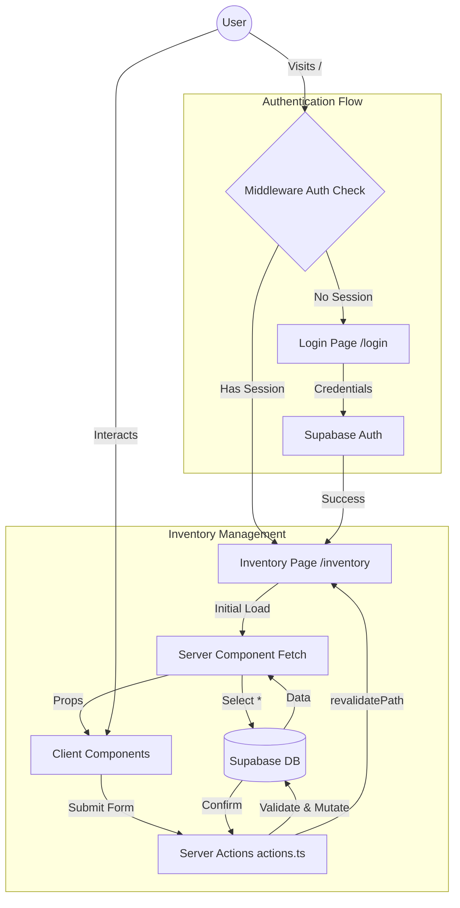

# Project Architecture & Workflow

## Overview
This is a modern **Inventory Management System** built with **Next.js 16 (App Router)** and **Supabase**. It leverages Server Components for data fetching and Server Actions for mutations, ensuring a secure and responsive application.

## 🛠 Tech Stack
-   **Framework:** Next.js 16.1.1 (App Router)
-   **Backend/DB:** Supabase (PostgreSQL + Auth)
-   **Styling:** Tailwind CSS v4 + Shadcn UI (Radix UI)
-   **Types:** TypeScript
-   **Forms/Validation:** React Hook Form + Zod
-   **Icons:** Lucide React

## 🏗 Architecture Components

### 1. Authentication (`middleware.ts`)
-   Uses `@supabase/ssr` to manage sessions via cookies.
-   **Protects** `/inventory` routes (redirects to `/login` if unauthenticated).
-   **Redirects** authenticated users from `/login` or `/` to `/inventory`.

### 2. Data Fetching (Server Components)
Data is fetched directly in Server Components (e.g., `src/app/inventory/page.tsx`) using the Supabase client.
```typescript
// Pattern used in InventoryPage
const supabase = await createClient()
const { data } = await supabase.from("inventory").select("*")
```
This data is passed down to client components (`DataTable`, `DashboardStats`) as props.

### 3. Data Mutation (Server Actions)
Mutations happen in `src/app/actions.ts` via standard Next.js Server Actions.
-   **Create:** `createItem(data: InventoryItem)`
-   **Update:** `updateItem(id, data)`
-   **Delete:** `deleteItem(id)`

These actions:
1.  Validate input using **Zod** (`inventoryItemSchema`).
2.  Perform DB operations via Supabase.
3.  Call `revalidatePath("/inventory")` to refresh the UI immediately.

### 4. Database Schema (Supabase)
Table: `inventory`
-   `id`: UUID
-   `name`: Text
-   `quantity`: Integer
-   `price`: Numeric
-   `category`: Text
-   `description`: Text
-   `created_at`: Timestamp

## 🔄 Workflow Diagram



## 📂 Key File Structure
-   `src/app/login/page.tsx`: Entry point for authentication.
-   `src/app/inventory/page.tsx`: Dashboard displaying `DashboardStats` and `DataTable`.
-   `src/app/actions.ts`: Centralized logic for all DB writes.
-   `src/types/inventory.ts`: Zod schema definitions.
-   `src/components/`: Reusable UI components (Shadcn based).
